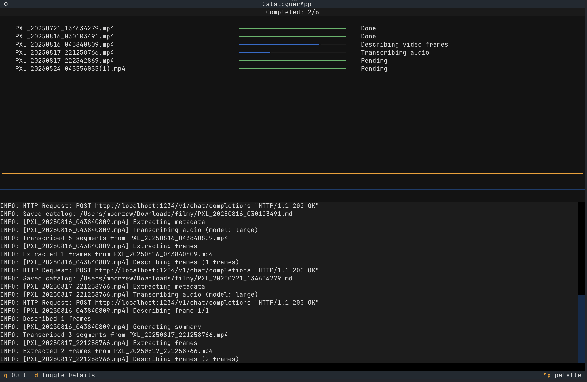

# video-cataloguer

A pipeline that reads videos in a folder, and for each video:

1. Extracts a few frames and asks a LLM to describe what's in them
2. Transcribes the audio track using Whisper model
3. Extracts metadata about the video

and then creates a Markdown file with all that to make the video itself searchable, and understandable to LLMs.

# Usage

First run `uv sync` to install the dependencies. Then `uv run video-cataloguer --help`.
